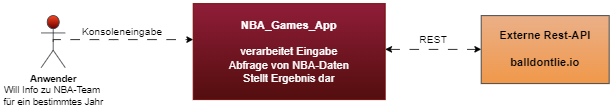
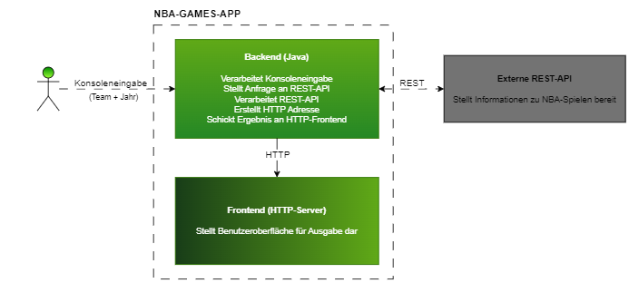

# Projektdokumentation

>Dokumentation zur Projektarbeit im Fach *Software Qualitätssicherung* an der TH Rosenheim (SoSe23) von Sebastian Graf

Der Aufbau dieser Dokumentation orientiert sich am offiziellen [Arc42-Template](https://docs.arc42.org/home/)

## Kapitel 0: Voraussetzungen
Folgende Softwarevoraussetzungen müssen zum lokalen Testen der Anwendung gegeben sein: 
- Java JDK 20

## Kapitel 1: Einleitung
### Fachliche Anforderungen
Die *NBA_Games_App* soll es dem Nutzer ermöglichen, Ergebnisse aller NBA-Spiele einer bestimmten Mannschaft, für eine bestimmmte Saison einzusehen. Die Ergebnisse sollen sortiert in Heim- und Auswärtsspiele sowie nach Datum in einer Tabelle auf einem HTTP-Server ausgegeben werden. 
Um die Daten zu erhalten wird eine REST-API-Anfrage an die öffentlich verfügbare Homepage [balldontlie](https://www.balldontlie.io/) gestellt. 
### Qualitätsziele
Auf relevante Qualitätsziele wird in [Kapitel 10](#Kapitel-10-qualität) eingegangen.
### Stakeholder
- Studenten des Fachs *Software Qualitätssicherung*
- Dozent des Fachs *Software Qualitätssicherung*

## Kapitel 2: Beschränkungen
Durch den Dozenten sind folgende Vorgaben für das Projekt festgelegt: 
- Frontend
- Backend
- Externe REST-API

## Kapitel 3: Kontext und Umfang
Die Diagramme orientieren sich am [C4 Modell](https://c4model.com/) zur Visualisierung von Software-Architektur.

### Kontextdiagramm (Level 1)
Das Kontextdiagramm zeigt das System und dessen Interaktionen mit externen Akteuren oder Systemen. Dieses Diagramm dient dazu, den Kontext des zu modellierenden Systems zu erfassen.

### Containerdiagramm (Level 2)
Das Containerdiagramm stellt die größeren Container oder Komponenten dar, aus denen das System besteht. Container können Webserver, Datenbanken, Anwendungen oder andere wichtige technische Elemente sein. Dieses Diagramm hilft dabei, die Hauptbestandteile des Systems zu identifizieren und deren Beziehungen zu visualisieren.

### Komponentendiagramm (Level 3)
todo

## Kapitel 4: Lösungsstrategie
### Technische Entscheidungen
- Frontend: HTTP-Server
- Backend: Java
- Externe REST-API: [balldontlie](https://www.balldontlie.io/)

Begründung: 

Die Verwendung eines **HTTP-Servers** als Frontend ermöglicht eine einfache Kommunikation zwischen Client und Server über das weit verbreitete und standatisierte HTTP-Protokoll. Ein HTTP-Server genügt den Anforderungen, sodass keine aufwändige Umsetzung mit Frameworks wie Vue.js oder React notwendig ist. Für den Umfang des Projektes ist also ein HTTP-Server gut geeignet. 

Die Verwendung von **Java** als Backend lässt sich durch eine umfangreiche Standardbibliothek und eine damit verbundene effiziente Entwicklung begründen. Außerdem bietet Java eine hohe Interoperabilität und Integretation mit anderen Technologien. Dies erleichtert die Integration des Frontends und der REST-API. 

**balldontlie** bietet eine umfassende Datenbank mit NBA-Statistiken, ist gut dokumentiert und frei verfügbar. Dies ermöglich eine effiziente Möglichkeit, Sportdaten in die Anwendung zu integrieren. 

### Qualitätsentscheidungen
Qualitätsziele werden in [Kapitel 10](#kapitel-10-qualität) näher erläutert.

## Kapitel 5: Baustein-Sicht
Die Bausteinsicht entspricht dem Kontextdiagramm in [Kapitel 3](#kapitel-3-kontext).
Im wesentlichen gibt es drei große Bausteine, die miteinander agieren: Der Benutzer, die NBA-GAME-APP und die REST-API. Der Benutzer agiert durch Konsoleneingabe direkt mit der App und diese interagiert über eine REST-Verbindung mit der REST-API. 

## Kapitel 6: Runtime-Sicht
Während der Laufzeit interagiert das System wie folgt: 
Der Benutzer wird zur Eingabe eines gültigen NBA-Teams und eines beliebigen Jahres von 1949 bis 2022 durch die Konsole aufgefordert. Diese Informationen werden auf ihre Korrektheit geprüft und gespeichert. Aus dem eingegebenen Teamnamen wird unter Verwendung eines Look-up-Tables die zugehörige Team-ID ermittelt. Aus den Informationen Team-ID und Jahr wird ein vorgefertigter Link so angepasst, dass er den Endpunkt für die REST-Anfrage an die externe REST-API darstellt. Der Endpunkt enthält die gewünschten Informationen und übermittelt diese im JSON-Format an das Backend. Dort werden sie für den Benutzer optisch ansprechend aufbereitet und an eine Klasse übergeben, die sie per HTTP-Protokoll auf einem HTTP-Server darstellt. Der Link zum Server wird ebenfalls spezifisch für die Anfrage angepasst und enthält in seinem Namen das angefragte Team und die errechnete Saison.

## Kapitel 7: Deployment-Sicht
Die Anwendung wird in einer skalierbaren Cloud-Umgebung bereitgestellt, wobei das Frontend als HTTP-Server und das Backend als Gruppe von skalierbaren Serverinstanzen implementiert sind. Durch eine interne Netzwerkverbindung und Lastenausgleichsmechanismen werden die Anfragen effizient verteilt. Die Integration mit der externen REST-API von balldontlie erfolgt über das Backend, während ein Monitoring- und Logging-System die Leistung und Fehlerzustände des Deployments überwacht.

## Kapitel 8: Querschnittskonzepte

### User Interface
Das User Interface der Anwendung ist eine Kombination aus Eingabe auf der Konsole und Ausgabe in einem HTTP Browser. Dies ermöglicht eine solide und robuste Ausführung der Anwendung. Die Handhabung der App ist sehr einfach, da der Benutzer durch Eingabeaufforderungen durch den Anwendungsprozess geleitet wird. Für die Ausgabe wurde die JSON-Antwort der externen REST-API optisch anspruchsvoll strukturiert. 
### Flexibilität
Das Backend der Anwendung bietet eine gute Basis für weitere Features, die der Anwendung hinzugefügt werden können. Insbesondere können einfach weitere Anfragen an die externe REST-API wie zum Beispiel konkrete Statistiken zu einzelnen Spielern implementiert werden.  

### Wartbarkeit
Der übersichtliche Aufbau des Backends und die Wahl von Java als Programmiersprache bieten eine gute Wartbarkeit der Anwendung. Nach Python ist Java die beliebteste Programmiersprache weltweit. Das führt dazu, dass es sehr viele Foreneinträge und Tutorials gibt, die wiederum zu einer guten Wartbarkeit des Projektes führen. 

### Sprache
Die Benutzerschnittstelle der Anwendung ist auf Deutsch lokalisiert, um eine intuitive Interaktion für den Benutzer zu ermöglichen. Das Backend hingegen wurde vollständig in Englisch entwickelt, um internationalen Standards und Konventionen zu entsprechen und die Integration mit anderen englischsprachigen Systemen zu erleichtern. Durch diese sprachliche Trennung wird die Konsistenz und Verständlichkeit sowohl für den Benutzer als auch für Entwickler gewährleistet.

## Kapitel 9: Architekturentscheidungen
Die wichtigsten Architekturentscheidungen werden als Architecture decision records (ADR) bezeichnet und sind nach dem Nygard-Schema dokumentiert.

|Sektion        |Beschreibung|
|---            |---         |
|Titel          |ADR 1: Verwendung eines HTTP-Servers als Frontend   |
|Kontext        | Die Applikation erfordert eine Benutzerschnittstelle, um die Interaktion mit dem Benutzer zu ermöglichen.  |
|Entscheidung   | Ein HTTP-Server wird als Frontend verwendet, um die Benutzerschnittstelle bereitzustellen. |
|Status         | Akzeptiert  |
|Konsequenzen   | Eine standardisierte Kommunikation über das HTTP-Protokoll wird ermöglicht. Die Entwicklung und Bereitstellung von Schnittstellen zur Verarbeitung von HTTP-Anfragen und -Antworten ist erforderlich.Es können zusätzliche Ressourcen für die Konfiguration und Wartung des HTTP-Servers erforderlich sein.|

|Sektion        |Beschreibung|
|---            |---         |
|Titel          |ADR 2: Verwendung von Java als Backend-Technologie  |
|Kontext        | Das Backend der Applikation muss in einer geeigneten Programmiersprache entwickelt werden.  |
|Entscheidung   | Das Backend wird in Java entwickelt. |
|Status         | Akzeptiert  |
|Konsequenzen   | Java bietet umfangreiche Frameworks und Bibliotheken für die Entwicklung von robusten und skalierbaren Backend-Komponenten. Die Integration mit externen Diensten und Bibliotheken ist in Java gut unterstützt. Entwickler müssen über Kenntnisse in Java verfügen, um das Backend zu entwickeln und zu warten.|

|Sektion        |Beschreibung|
|---            |---         |
|Titel          |ADR 3: Integration einer externen REST-API  |
|Kontext        | Die Applikation benötigt den Zugriff auf spezifische Daten und Funktionalitäten, die von der externen REST-API bereitgestellt werden.  |
|Entscheidung   | Die Applikation integriert die externe REST-API von balldontlie. |
|Status         | Akzeptiert  |
|Konsequenzen   | Die Integration ermöglicht den Zugriff auf Daten und Funktionalitäten von balldontlie. Die Applikation ist von der Verfügbarkeit und der Stabilität der externen REST-API abhängig. Anpassungen im Code sind erforderlich, um die Kommunikation mit der externen REST-API zu ermöglichen.|

|Sektion        |Beschreibung|
|---            |---         |
|Titel          |ADR 4: Keine Verwendung einer SQL-Datenbank |
|Kontext        | Die spezifischen Anforderungen der Applikation lassen den Einsatz einer SQL-Datenbank als ungeeignet erscheinen. |
|Entscheidung   |  Die Applikation wird bewusst auf den Einsatz einer SQL-Datenbank verzichten. |
|Status         | Vorgeschlagen  |
|Begründung   | Eine SQL-Datenbank würde zusätzlichen Overhead und Komplexität hinzufügen, ohne einen signifikanten Mehrwert für den Anwendungsfall zu bieten. Es ist sichergestellt, dass die externe REST-API eine hohe Verfügbarkeit und Zuverlässigkeit aufweist, um die kontinuierliche Verfügbarkeit der relevanten Daten sicherzustellen. |

## Kapitel 10: Qualitätssichernde Maßnahmen und Tests

